# Automotive Inventory Dashboard API
This repository contains the backend RESTful API for an Automotive Inventory Dashboard Application, developed as a technical challenge solution for Keyloop. The application is built using a modern, robust, enterprise-grade stack designed to manage managers, inventories, and vehicle stock records effectively within the automotive retail space.

## Tech Stack & Architecture
- Backend Framework: Java Spring Boot (v3+)

- Database: PostgreSQL

- Data Access & ORM: Spring Data JPA / Hibernate

- Build Tool: Gradle

- Containerization: Docker & Docker Compose

- Observability: OpenTelemetry (OTel) & Jaeger UI (Distributed Tracing)

- API Documentation: Swagger / OpenAPI

## Getting Started
Prerequisites
Make sure you have the following installed on your machine:

- Java 17 or 21

- Docker & Docker Compose

1. Build the Application
Before containerizing the service, clean and compile the Spring Boot application bytecode locally to generate the executable fat JAR file:

`./gradlew clean build`

2. Start the Infrastructure
Spin up the decoupled PostgreSQL database, the Spring Boot application container, and the Jaeger distributed tracing suite simultaneously:

`docker compose up --build`

Note: If you run into issues with cached or malformed dependency layers within Docker, execute a clean build reset using: `docker compose down -v` && `./gradlew clean build` && `docker compose up --build`

## Testing Endpoints & Authentication Flow
While the application exposes a Swagger UI hub at http://localhost:8080/swagger-ui/index.html as its primary API contract, using an external REST client like Postman is highly recommended to systematically step through the stateful, authenticated workflows.

### The Required API Sequence
Every interaction requires an active, registered Dealership Manager session. You must follow this sequence exactly:

__Step 1__: Register a New Dealership Manager (Public Open Endpoint)
HTTP Method: POST

URL: http://localhost:8080/inventorydashboard/register

- Payload (application/json):

```json
{
  "username": "string",
  "password": "string",
  "name": "string",
  "dealershipName": "string",
  "location": "string"
}
```

- Expected Outcome: 200 OK along with the newly provisioned Manager object and empty initial Inventory shell.

__Step 2__: Accessing Authenticated Endpoints (Basic Auth)
All underlying features—such as querying data models, viewing dealer allocations, tracking aging stock, or executing standard mutations—require mandatory protection mechanisms.

- In Postman, click on the Authorization tab of your subsequent request.

- Select Basic Auth from the Type dropdown menu.

- Input the exact username and password created in Step 1.

- Submit requests securely (e.g., fetching a specific sub-inventory):
GET http://localhost:8080/inventorydashboard/managers/{managerId}/inventories/{inventoryId}

__Postman Collection__: To run these tests yourself, import the Keyloop_inventory_dashboard.postman_collection.json file located in the repository (inside /docs/postman/) directly into your local Postman client.

## Testing & Verification

In addition to running the automated JUnit test suite (`./gradlew test`), you can manually verify the API endpoints using Postman. Below are visual confirmations of the end-to-end integration flows:

### Postman Executions

<details>
<summary><b>1. Register New Manager (POST /inventorydashboard/register)</b></summary>
<br>
Shows successful manager registration

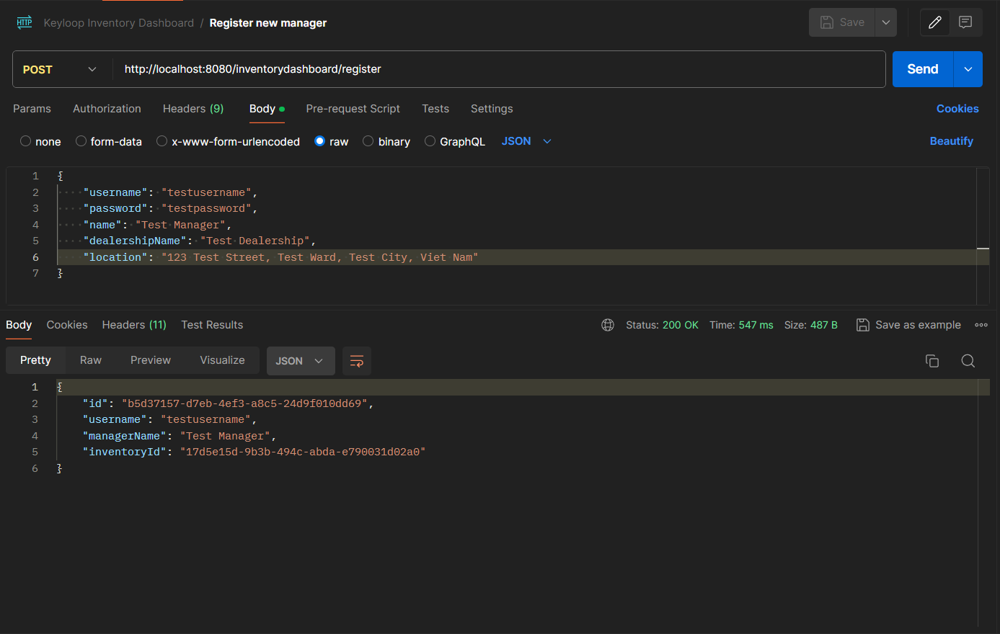

Shows failed manager registration

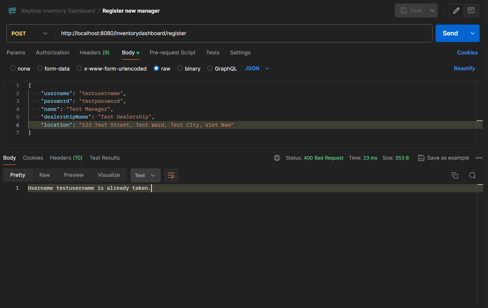
</details>

<details>
<summary><b>2. Get Manager Details (GET /inventorydashboard/managers/{managerId})</b></summary>
<br>
Shows manager details

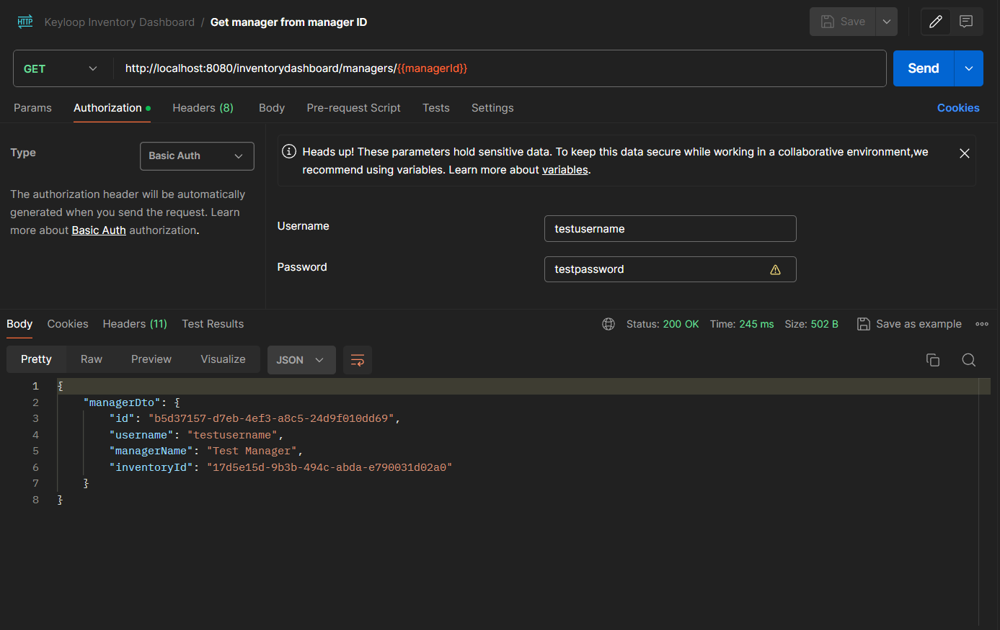

Failed to show manager details

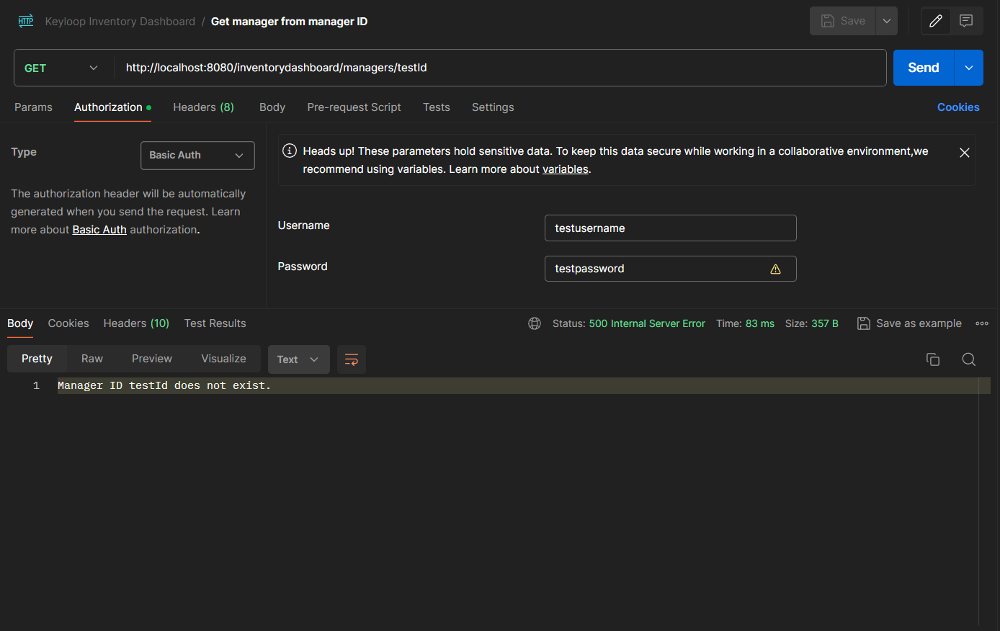
</details>

<details>
<summary><b>3. Get Inventory Details (GET /inventorydashboard/managers/{managerId}/inventories/{inventoryId})</b></summary>
<br>
Shows inventory details

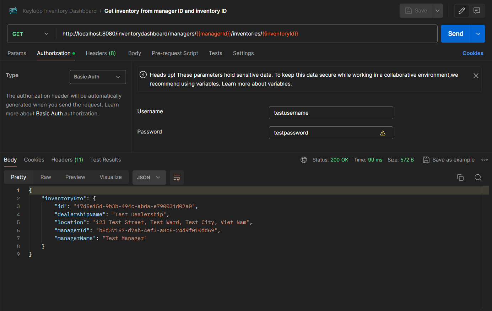

Failed to show inventory details

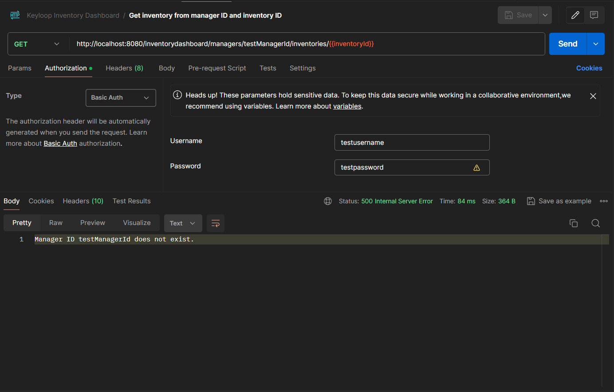


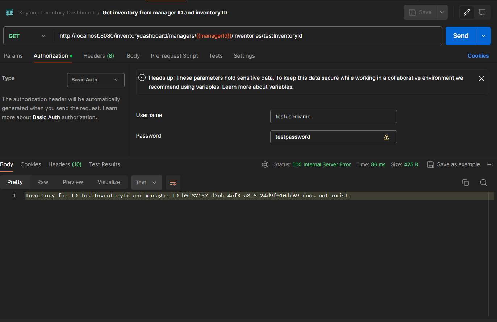
</details>

<details>
<summary><b>4. Get Filtered and Paginated List of Vehicles (GET /inventorydashboard/inventories/{inventoryId}/vehicles)</b></summary>
<br>
Shows paginated and filtered list of vehicles

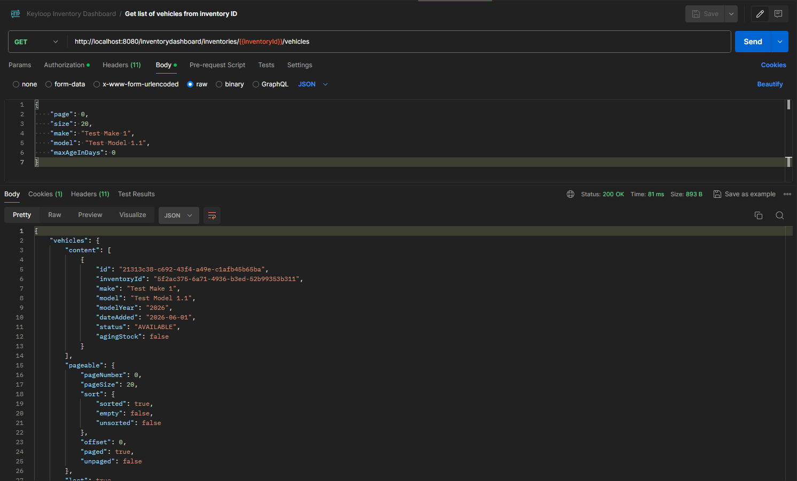
</details>

<details>
<summary><b>5. Get a Vehicle (GET /inventorydashboard/inventories/{inventoryId}/vehicles/{vehicleId})</b></summary>
<br>
Shows vehicle details

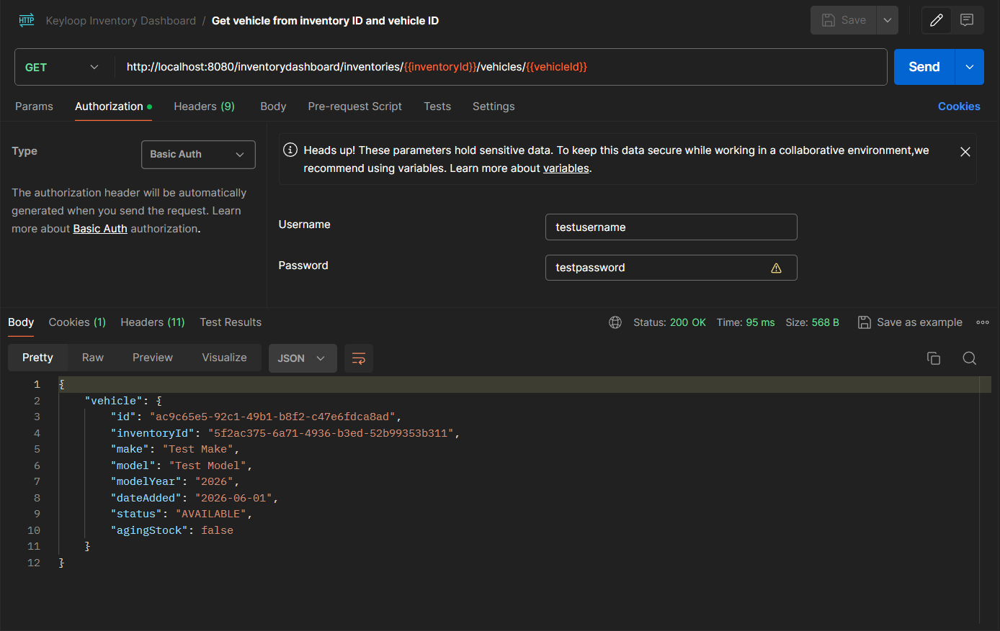

Failed to show vehicle details

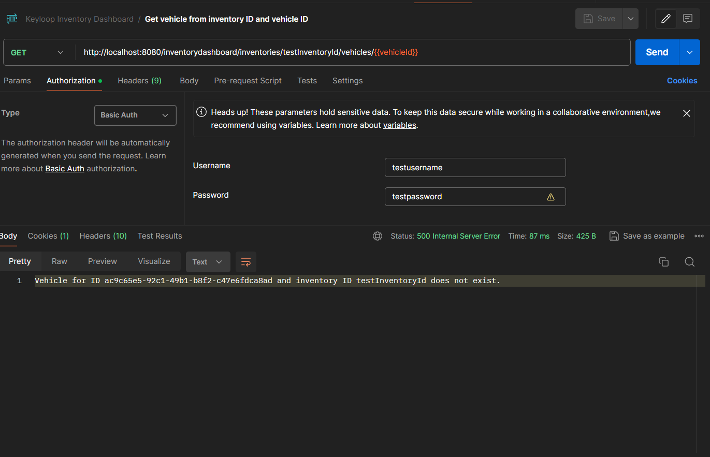


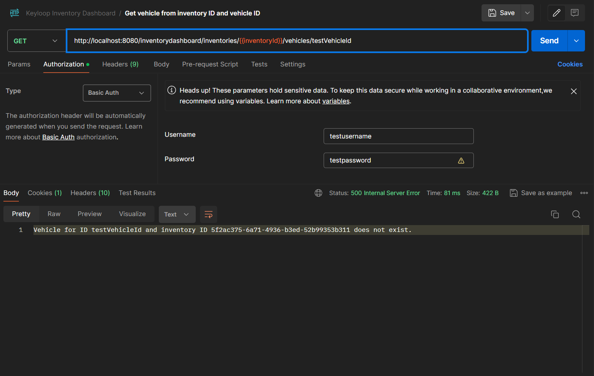
</details>

<details>
<summary><b>6. Change Vehicle Status (POST /inventorydashboard/inventories/{inventoryId}/vehicles/{vehicleId}/status)</b></summary>
<br>
Shows vehicle details with changed status

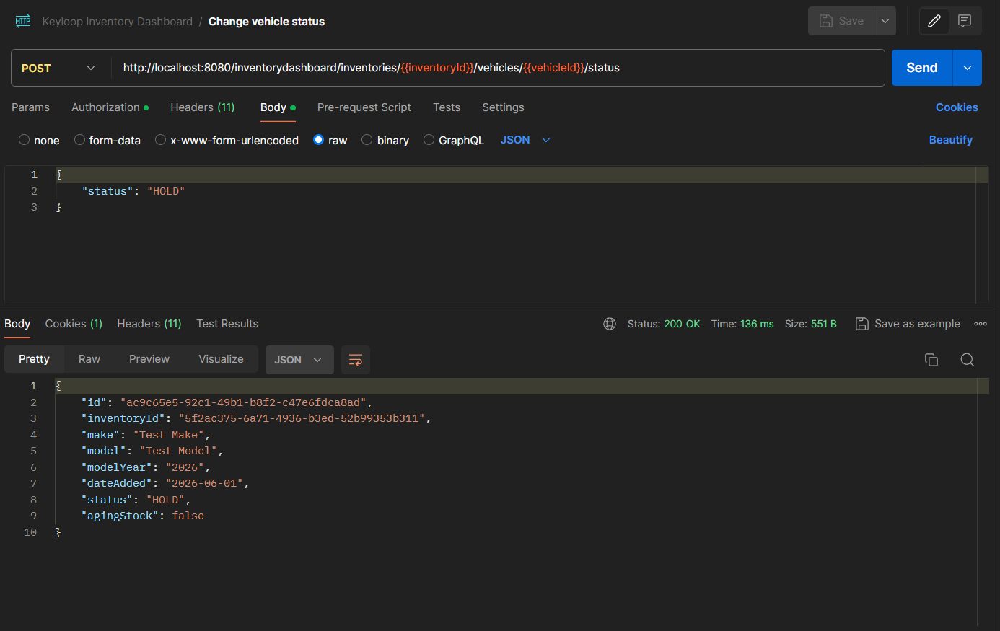

Failed to change vehicle status

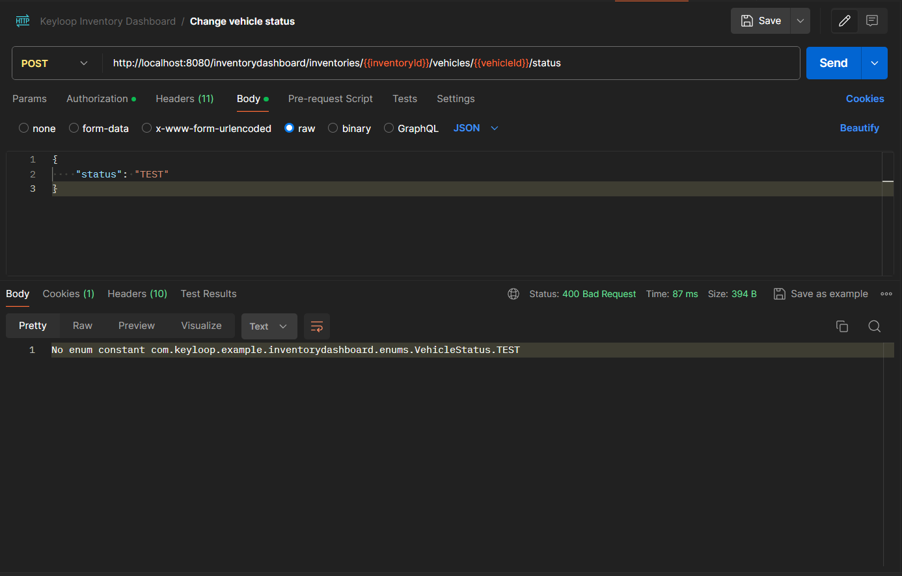


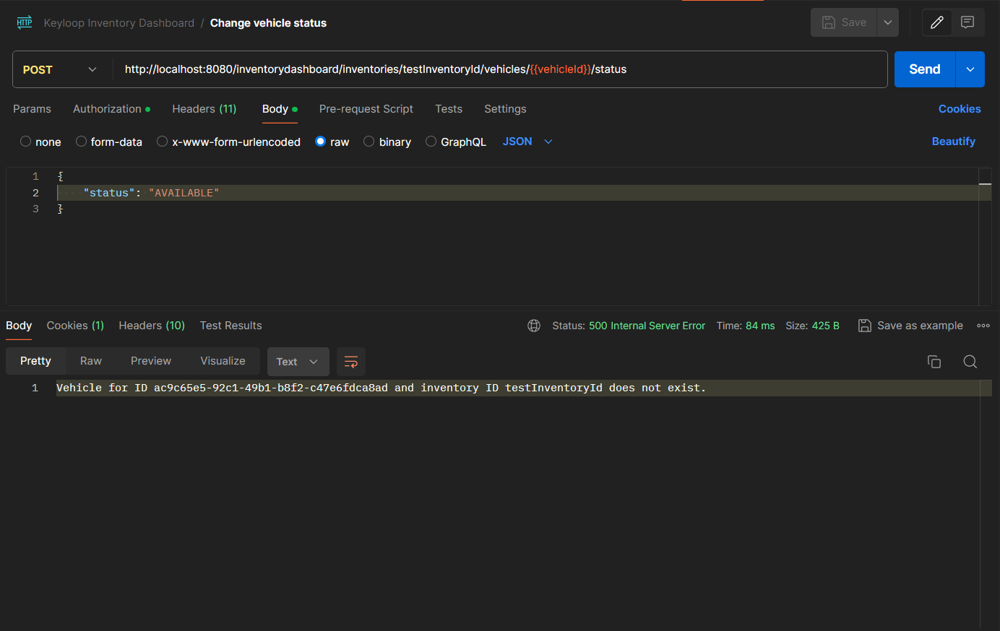
</details>

<details>
<summary><b>7. Add New Vehicle (POST /inventorydashboard/inventories/{inventoryId}/vehicles/new)</b></summary>
<br>
Shows new vehicle details

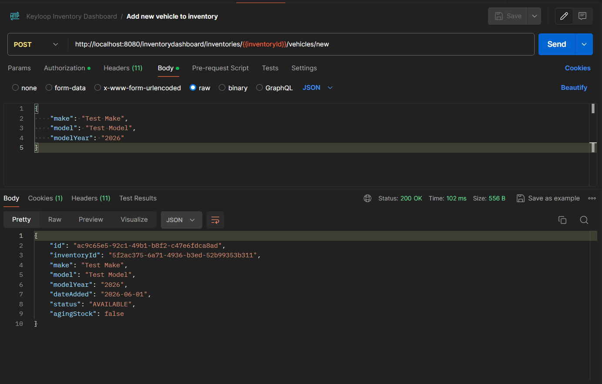
</details>

## Observability & Distributed Tracing
The application features full transactional monitoring pipelines. Every incoming API traffic request triggers automatic telemetry correlation IDs across Spring frameworks down into native PostgreSQL database runtime sessions.

- Jaeger Dashboard UI: Open your browser and navigate to http://localhost:16686

- Tracing Capabilities: View chronological waterfall request charts, isolated endpoint execution latency metrics, and pinpoint specific slow-running database queries.

- Log Management: To optimize processing metrics during development, OpenTelemetry logging targets focus on visual distributed traces (/v1/traces), while Jaeger metric metrics warnings are cleanly silenced out of the box.

## AI Co-Pilot Collaboration Report

An integral phase of designing, refining, and validating this application involved a structural engineering partnership with an advanced AI model (Google Gemini). Below is a summary of the strategic governance framework, testing processes, and code quality controls executed during development.

1. High-Level AI Guidance Strategy
To ensure the AI generated accurate, working code instead of generic templates, development followed a structured, step-by-step approach:

One Component at a Time: The AI was guided to solve specific tasks in order. For example, we first set up database IDs, moved on to error handling, built the login security layer, and finally created data validation rules.

Staying Focused on the Automotive Domain: Every prompt reminded the AI that the application was specifically for Keyloop’s automotive dashboard (managing dealership lots, tracking how many days cars sit in inventory, etc.). This kept the code relevant to the scenario's requirement.

2. Output Verification & Refinement Process
No code from the AI was trusted blindly. Every suggestion went through a strict evaluation loop before being added to the final project:

Local Sanity Checks: When adding framework tools (like data validation annotations), small tests were run immediately to make sure Spring Boot was actually reading and enforcing the rules.

Catching and Fixing Bugs: When edge-case bugs popped up during development—such as database timestamps returning null values or Docker files caching old files—the errors were fed back to the AI. This allowed us to quickly pivot to reliable solutions like switching from standard save() to saveAndFlush() and cleaning up the Docker configuration.

3. Ensuring Final Code Quality
To ensure the code is clean, stable, and easy to maintain, we used a dependable testing and architecture layout:

Unit Testing Layer: We built isolated tests using JUnit 5 and MockMvc to verify controllers. These tests make sure that missing inputs are caught immediately and that the server returns a clean 400 Bad Request error instead of crashing.

Integration Testing Layer: We wrote database-connected tests to verify that the relationships between services, repositories, entities, and database work perfectly when running together.